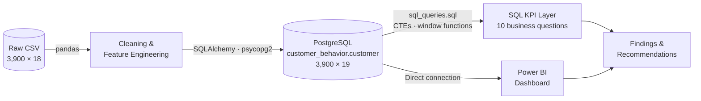

# Customer Behavior Analysis — Retail Segmentation & Purchase Insights

<p align="center">
  <strong>End-to-end customer analytics pipeline: Python cleaning → PostgreSQL warehouse → SQL KPI layer → Power BI dashboard</strong>
</p>

<p align="center">
  
  
  
  
  
  
</p>

---

## TL;DR

Analyzed **3,900 retail customer purchase records** (25 products, 4 categories, 50 US states) to answer ten business questions about revenue drivers, discounting, subscriptions, and customer loyalty. Data was cleaned and feature-engineered in Pandas, loaded into PostgreSQL, queried with a 10-query SQL layer (CTEs, window functions, subqueries), and visualized in Power BI.

| Metric | Value |
|---|---|
| Customer records analyzed | **3,900** |
| Total revenue | **$233,081** |
| Average order value (AOV) | **$59.76** |
| Loyal customers (>10 prior purchases) | **79.9 %** of base · **79.6 %** of revenue |
| Orders with a discount applied | **43.0 %** |
| Subscription rate | **27.0 %** (100 % of subscribers used a discount) |
| Data-quality fixes | 37 missing ratings imputed · 1 redundant column dropped · 2 features engineered |

**Headline finding:** revenue is concentrated in *loyal repeat customers*, while the two levers most retailers reach for — **discounts and subscriptions — show no lift in order value** in this dataset (discounted AOV $59.28 vs. $60.13; subscriber AOV $59.49 vs. $59.87). Retention, not promotion, is where the money is.

---

## Table of Contents

1. [Business Problem](#1-business-problem)
2. [Architecture](#2-architecture)
3. [Dataset](#3-dataset)
4. [Data Preparation & Feature Engineering](#4-data-preparation--feature-engineering)
5. [Database Schema](#5-database-schema)
6. [SQL Analytics — 10 Business Questions](#6-sql-analytics--10-business-questions)
7. [Key Findings & Recommendations](#7-key-findings--recommendations)
8. [Power BI Dashboard](#8-power-bi-dashboard)
9. [Repository Structure](#9-repository-structure)
10. [Reproduce Locally](#10-reproduce-locally)
11. [Limitations & Caveats](#11-limitations--caveats)
12. [Roadmap](#12-roadmap)

---

## 1. Business Problem

A retail business wants to understand **who its customers are, what they buy, and which levers actually move revenue**, so that marketing spend can be directed at the segments and tactics that pay off. The analysis was scoped to ten concrete questions a marketing or CRM team would ask:

| # | Business Question | Decision it informs |
|---|---|---|
| 1 | How does revenue split between male and female customers? | Audience targeting |
| 2 | Which discount users still spend above the average order value? | Discount eligibility rules |
| 3 | Which products have the highest average review rating? | Merchandising / featured products |
| 4 | Do Express shippers spend more than Standard shippers? | Shipping-tier upsell |
| 5 | Do subscribers spend more than non-subscribers? | Subscription program ROI |
| 6 | Which products are most dependent on discounts? | Margin protection |
| 7 | How large are the New / Returning / Loyal segments? | Retention vs. acquisition budget |
| 8 | What are the top 3 products in each category? | Inventory & category planning |
| 9 | Are repeat buyers more likely to subscribe? | Subscription targeting |
| 10 | Which age group contributes the most revenue? | Demographic targeting |

---

## 2. Architecture



| Layer | Tooling | Responsibility |
|---|---|---|
| Ingestion & cleaning | Python 3, Pandas | Null handling, schema normalization, feature engineering |
| Storage | PostgreSQL | Single analytical table with typed columns |
| Analytics | SQL (PostgreSQL dialect) | Aggregations, subqueries, CTEs, `ROW_NUMBER()` window ranking |
| Visualization | Power BI Desktop | Interactive dashboard over the PostgreSQL table |

---

## 3. Dataset

**Source:** Customer Shopping Trends dataset (public, Kaggle) — 3,900 rows × 18 columns, one row per customer.

<details>
<summary><strong>Data dictionary (raw columns)</strong></summary>

| Column | Type | Description | Example |
|---|---|---|---|
| `Customer ID` | int | Unique customer identifier (1–3900) | `1` |
| `Age` | int | Customer age, 18–70 | `55` |
| `Gender` | text | Male / Female | `Male` |
| `Item Purchased` | text | Product name (25 distinct) | `Blouse` |
| `Category` | text | Clothing / Accessories / Footwear / Outerwear | `Clothing` |
| `Purchase Amount (USD)` | int | Order value in USD | `53` |
| `Location` | text | US state (50 distinct) | `Kentucky` |
| `Size` | text | S / M / L / XL | `L` |
| `Color` | text | Product colour | `Gray` |
| `Season` | text | Spring / Summer / Fall / Winter | `Winter` |
| `Review Rating` | float | 1.0–5.0; **37 nulls** | `3.1` |
| `Subscription Status` | text | Yes / No | `Yes` |
| `Shipping Type` | text | Standard, Express, Free Shipping, Next Day Air, 2-Day Shipping, Store Pickup | `Express` |
| `Discount Applied` | text | Yes / No | `Yes` |
| `Promo Code Used` | text | Yes / No — **identical to `Discount Applied` in 100 % of rows** | `Yes` |
| `Previous Purchases` | int | Count of prior purchases | `14` |
| `Payment Method` | text | PayPal, Credit Card, Cash, Debit Card, Venmo, Bank Transfer | `Venmo` |
| `Frequency of Purchases` | text | Weekly … Annually (7 labels) | `Fortnightly` |

</details>

**Profile at a glance**

| Dimension | Breakdown |
|---|---|
| Category mix (orders) | Clothing 44.5 % · Accessories 31.8 % · Footwear 15.4 % · Outerwear 8.3 % |
| Gender mix (customers) | Male 68.0 % · Female 32.0 % |
| Age | 18–70, median 44 |
| Revenue by season | Fall $60,018 · Spring $58,679 · Winter $58,607 · Summer $55,777 |

---

## 4. Data Preparation & Feature Engineering

All preparation is in [`Customer_behaviour_Analysis.ipynb`](Customer_behaviour_Analysis.ipynb). Every transformation was a deliberate, documented decision:

| Step | Issue / Goal | Decision | Rationale |
|---|---|---|---|
| **Null handling** | 37 missing `review_rating` (0.95 %) | Impute with **category median** (Accessories 3.8 · Clothing 3.7 · Footwear 3.8 · Outerwear 3.8) | Ratings differ slightly by category; median is robust to skew; dropping rows would discard valid purchase data |
| **Schema normalization** | Mixed-case, spaced column names | Lower-case `snake_case`; `purchase_amount_(usd)` → `purchase_amount` | SQL-friendly identifiers, no quoting needed |
| **Redundancy check** | `promo_code_used` vs. `discount_applied` | Verified `(promo_code_used == discount_applied).all()` → **True**; dropped `promo_code_used` | Perfectly collinear column adds no information |
| **Feature: `age_group`** | Continuous age is hard to segment on | Quartile binning with `pd.qcut(q=4)` → **Young Adult 18–31 · Adult 32–44 · Middle-Aged 45–57 · Senior 58–70** | Equal-sized bins (≈975 each) avoid sparse groups and analyst-chosen cut-points |
| **Feature: `purchased_frequency_days`** | Purchase frequency is a text label | Mapped to numeric cadence in days (see below) | Enables arithmetic (e.g., implied annual purchase rate) |
| **Load** | Persist for SQL + BI | `df.to_sql("customer", engine, if_exists="replace")` via SQLAlchemy | Single source of truth for both SQL and Power BI |

**Frequency → days mapping**

| Label | Days | Label | Days |
|---|---|---|---|
| Weekly | 7 | Quarterly | 90 |
| Fortnightly | 14 | Every 3 Months | 90 |
| Bi-Weekly | 14 | Annually | 365 |
| Monthly | 30 | | |

> The dataset uses two labels for the same cadence twice (*Fortnightly / Bi-Weekly*, *Quarterly / Every 3 Months*). Mapping both to one value normalizes them without deleting rows.

**Result:** 3,900 rows × **19 columns**, zero nulls, ready for SQL.

---

## 5. Database Schema

Database `customer_behavior`, table `customer` (one row per customer):

```sql
CREATE TABLE customer (
    customer_id                INTEGER PRIMARY KEY,
    age                        INTEGER,
    gender                     TEXT,
    item_purchased             TEXT,
    category                   TEXT,
    purchase_amount            INTEGER,          -- USD
    location                   TEXT,
    size                       TEXT,
    color                      TEXT,
    season                     TEXT,
    review_rating              DOUBLE PRECISION, -- nulls imputed by category median
    subscription_status        TEXT,             -- 'Yes' / 'No'
    shipping_type              TEXT,
    discount_applied           TEXT,             -- 'Yes' / 'No'
    previous_purchases         INTEGER,
    payment_method             TEXT,
    frequency_of_purchases     TEXT,
    age_group                  TEXT,             -- engineered
    purchased_frequency_days   INTEGER           -- engineered
);
```

---

## 6. SQL Analytics — 10 Business Questions

All queries live in [`sql_queries.sql`](sql_queries.sql). Each answer below was produced by the query shown and cross-checked in Pandas.

### Q1 · Revenue by gender

| Gender | Customers | Revenue | Share | AOV |
|---|---:|---:|---:|---:|
| Male | 2,652 | $157,890 | 67.7 % | $59.54 |
| Female | 1,248 | $75,191 | 32.3 % | $60.25 |

**Insight:** the revenue gap is entirely a *volume* gap — per-order spend is equal. Growth opportunity is female customer acquisition, not upsell.

<details><summary>SQL</summary>

```sql
SELECT gender, SUM(purchase_amount) AS revenue
FROM customer
GROUP BY gender;
```
</details>

### Q2 · Discount users who still spend above average

**839 of 1,677** discount users (**50.0 %**) spent at or above the $59.76 average order value.

**Insight:** half of discount recipients would likely have been high-value orders anyway — a candidate for tighter discount targeting.

<details><summary>SQL</summary>

```sql
SELECT customer_id, purchase_amount
FROM customer
WHERE discount_applied = 'Yes'
  AND purchase_amount >= (SELECT AVG(purchase_amount) FROM customer);
```
</details>

### Q3 · Top 5 products by average review rating

| Rank | Product | Avg Rating | Reviews |
|---:|---|---:|---:|
| 1 | Gloves | 3.86 | 140 |
| 2 | Sandals | 3.84 | 160 |
| 3 | Boots | 3.82 | 144 |
| 4 | Hat | 3.80 | 154 |
| 5 | Handbag | 3.78 | 153 |

**Insight:** ratings are tightly clustered (3.7–3.9 across all 25 products) — rating is a weak differentiator in this dataset.

<details><summary>SQL</summary>

```sql
SELECT item_purchased,
       ROUND(AVG(review_rating::numeric), 2) AS avg_rating
FROM customer
GROUP BY item_purchased
ORDER BY avg_rating DESC
LIMIT 5;
```
</details>

### Q4 · Standard vs. Express shipping

| Shipping | Orders | AOV |
|---|---:|---:|
| Express | 646 | $60.48 |
| Standard | 654 | $58.46 |

**Insight:** Express shippers spend **+$2.02 (+3.5 %)** per order — a small but consistent premium.

<details><summary>SQL</summary>

```sql
SELECT shipping_type, ROUND(AVG(purchase_amount), 2) AS avg_spend
FROM customer
WHERE shipping_type IN ('Standard', 'Express')
GROUP BY shipping_type;
```
</details>

### Q5 · Subscribers vs. non-subscribers

| Subscription | Customers | AOV | Revenue | Revenue share |
|---|---:|---:|---:|---:|
| Yes | 1,053 | $59.49 | $62,645 | 26.9 % |
| No | 2,847 | $59.87 | $170,436 | 73.1 % |

**Insight:** subscription does **not** lift order value. Further, **100 % of subscribers used a discount** vs. 21.9 % of non-subscribers — the program is functioning as a discount channel rather than a loyalty driver.

<details><summary>SQL</summary>

```sql
SELECT subscription_status,
       COUNT(customer_id)              AS total_customers,
       ROUND(AVG(purchase_amount), 2)  AS avg_spend,
       ROUND(SUM(purchase_amount), 2)  AS total_revenue
FROM customer
GROUP BY subscription_status
ORDER BY total_revenue DESC;
```
</details>

### Q6 · Most discount-dependent products

| Rank | Product | Discount rate |
|---:|---|---:|
| 1 | Hat | 50.0 % |
| 2 | Sneakers | 49.7 % |
| 3 | Coat | 49.1 % |
| 4 | Sweater | 48.2 % |
| 5 | Pants | 47.4 % |

Overall discount rate: **43.0 %**.

**Insight:** these five SKUs are discounted on roughly every other order — the first place to test margin recovery.

<details><summary>SQL</summary>

```sql
SELECT item_purchased,
       ROUND(100.0 * SUM(CASE WHEN discount_applied = 'Yes' THEN 1 ELSE 0 END)
             / COUNT(*), 2) AS discount_rate
FROM customer
GROUP BY item_purchased
ORDER BY discount_rate DESC
LIMIT 5;
```
</details>

### Q7 · Customer segments by purchase history

Segment rule: **New** = 1 prior purchase · **Returning** = 2–10 · **Loyal** = 11+

| Segment | Customers | Share | AOV | Revenue | Revenue share |
|---|---:|---:|---:|---:|---:|
| Loyal | 3,116 | 79.9 % | $59.54 | $185,517 | 79.6 % |
| Returning | 701 | 18.0 % | $60.93 | $42,711 | 18.3 % |
| New | 83 | 2.1 % | $58.47 | $4,853 | 2.1 % |

**Insight:** four in five customers are already loyal; only 2 % are new. Retention is the core business, and the acquisition funnel in this snapshot is thin.

<details><summary>SQL</summary>

```sql
WITH customer_type AS (
    SELECT customer_id,
           previous_purchases,
           CASE
               WHEN previous_purchases = 1              THEN 'New'
               WHEN previous_purchases BETWEEN 2 AND 10 THEN 'Returning'
               ELSE 'Loyal'
           END AS customer_segment
    FROM customer
)
SELECT customer_segment, COUNT(*) AS number_of_customers
FROM customer_type
GROUP BY customer_segment;
```
</details>

### Q8 · Top 3 products per category

| Category | #1 | #2 | #3 |
|---|---|---|---|
| Accessories | Jewelry (171) | Belt (161) | Sunglasses (161) |
| Clothing | Blouse (171) | Pants (171) | Shirt (169) |
| Footwear | Sandals (160) | Shoes (150) | Sneakers (145) |
| Outerwear | Jacket (163) | Coat (161) | — (only 2 SKUs) |

<details><summary>SQL</summary>

```sql
WITH item_counts AS (
    SELECT category,
           item_purchased,
           COUNT(customer_id) AS total_orders,
           ROW_NUMBER() OVER (PARTITION BY category
                              ORDER BY COUNT(customer_id) DESC) AS item_rank
    FROM customer
    GROUP BY category, item_purchased
)
SELECT item_rank, category, item_purchased, total_orders
FROM item_counts
WHERE item_rank <= 3;
```
</details>

### Q9 · Are repeat buyers more likely to subscribe?

Among **3,476** repeat buyers (>5 prior purchases): **958 subscribed (27.6 %)** vs. a **27.0 %** overall subscription rate.

**Insight:** no meaningful lift — purchase history does not predict subscription in this dataset.

<details><summary>SQL</summary>

```sql
SELECT subscription_status, COUNT(customer_id) AS repeat_buyers
FROM customer
WHERE previous_purchases > 5
GROUP BY subscription_status;
```
</details>

### Q10 · Revenue by age group

| Age group | Ages | Customers | Revenue | Share | AOV |
|---|---|---:|---:|---:|---:|
| Young Adult | 18–31 | 1,028 | $62,143 | 26.7 % | $60.45 |
| Middle-Aged | 45–57 | 986 | $59,197 | 25.4 % | $60.04 |
| Adult | 32–44 | 942 | $55,978 | 24.0 % | $59.42 |
| Senior | 58–70 | 944 | $55,763 | 23.9 % | $59.07 |

**Insight:** revenue is nearly flat across age quartiles (spread < 3 pp). Age is not a useful segmentation axis here — behavior (segment, discount use) is.

<details><summary>SQL</summary>

```sql
SELECT age_group, SUM(purchase_amount) AS total_revenue
FROM customer
GROUP BY age_group
ORDER BY total_revenue DESC;
```
</details>

---

## 7. Key Findings & Recommendations

| # | Finding | Evidence | Recommendation |
|---|---|---|---|
| 1 | **Revenue is a loyalty business** | Loyal segment = 79.9 % of customers, 79.6 % of revenue; New = 2.1 % | Fund retention first: tiered loyalty perks for Loyal, win-back cadence for Returning. Audit the top-of-funnel — 2 % new is unusually low. |
| 2 | **Discounts don't grow baskets** | Discounted AOV $59.28 vs. $60.13 undiscounted; 43 % of orders discounted; 50 % of discount users already spend above average | Move from blanket to targeted discounts. A/B test removing discounts on Hat, Sneakers, Coat, Sweater, Pants (each ~48–50 % discounted). |
| 3 | **Subscription = discount channel** | Subscriber AOV $59.49 vs. $59.87; 100 % of subscribers used a discount vs. 21.9 % of non-subscribers | Redesign the value proposition around non-price perks (early access, free shipping tier) and measure retention, not just AOV. |
| 4 | **Gender gap is volume, not value** | Male 67.7 % of revenue but AOV within $0.71 of female | Growth = female acquisition. Note: **0 of 1,053 subscribers are female** — either a data artifact or an untapped segment; validate before acting. |
| 5 | **Demographics are flat; behavior isn't** | Age-group revenue share ranges only 23.9–26.7 % | Segment campaigns on purchase history and discount sensitivity rather than age. |
| 6 | **Small shipping premium** | Express AOV +3.5 % over Standard | Bundle Express with higher-value SKUs; not a primary lever. |
| 7 | **Seasonality is mild** | Fall $60.0K vs. Summer $55.8K (−7.6 %) | Time promotions for Summer softness; no drastic seasonal re-planning needed. |

---

## 8. Power BI Dashboard

The interactive dashboard ([`customer_behavior_dashboard.pbix`](customer_behavior_dashboard.pbix)) connects directly to the PostgreSQL table and lets stakeholders slice every metric above by category, season, gender, age group, segment, and subscription status.

<!-- TODO: export 2–3 screenshots from the .pbix to docs/screenshots/ and update the paths below -->
<p align="center">
  
</p>

| Dashboard view | What it shows |
|---|---|
| **Overview** | Revenue, AOV, customers, discount rate, subscription rate KPI cards with slicers |
| **Customer segments** | New / Returning / Loyal mix, revenue by segment, age-group and gender split |
| **Product performance** | Top products per category, average rating, discount dependency |
| **Discounts & subscriptions** | Discounted vs. full-price AOV, subscriber vs. non-subscriber behavior |

> Open the `.pbix` in **Power BI Desktop** and point the data source at your local PostgreSQL instance (see [Reproduce Locally](#10-reproduce-locally)).

---

## 9. Repository Structure

```
Customer_Behavior_Analysis/
├── Customer_behaviour_Analysis.ipynb        # Cleaning, feature engineering, PostgreSQL load
├── sql_queries.sql                           # 10 analytical queries (Q1–Q10)
├── customer_behavior_dashboard.pbix          # Power BI dashboard
├── customer_shopping_behavior dataset.csv    # Raw source data (3,900 × 18)
├── docs/
│   └── screenshots/                          # Dashboard images used in this README
├── LICENSE                                   # MIT
└── README.md
```

---

## 10. Reproduce Locally

**Prerequisites:** Python 3.10+, PostgreSQL 13+, Power BI Desktop (optional, for the dashboard).

```bash
# 1. Clone
git clone https://github.com/kumarvishal10351/Customer_Behavior_Analysis.git
cd Customer_Behavior_Analysis

# 2. Python environment
python -m venv .venv
source .venv/bin/activate          # Windows: .venv\Scripts\activate
pip install pandas sqlalchemy psycopg2-binary jupyter

# 3. Create the database
psql -U postgres -c "CREATE DATABASE customer_behavior;"

# 4. Configure the connection (never hard-code credentials)
export DATABASE_URL="postgresql+psycopg2://postgres:<password>@localhost:5432/customer_behavior"

# 5. Run the notebook end-to-end (cleans data and loads the `customer` table)
jupyter nbconvert --to notebook --execute Customer_behaviour_Analysis.ipynb

# 6. Run the SQL analytics
psql -U postgres -d customer_behavior -f sql_queries.sql
```

In the notebook, the engine is created from the environment variable:

```python
import os
from sqlalchemy import create_engine

engine = create_engine(os.environ["DATABASE_URL"])
df.to_sql("customer", engine, if_exists="replace", index=False)
```

---

## 11. Limitations & Caveats

Honest scoping matters more than impressive-sounding claims. Things this analysis **cannot** tell you:

- **Snapshot, not time series.** There are no order timestamps, so cohort analysis, true RFM (no *recency*), and trend/seasonality-over-time are out of scope. `season` is a label on the purchase, not a date.
- **One row per customer.** `customer_id` is unique, so each row is a single representative purchase. Revenue figures describe this snapshot, not lifetime value.
- **Near-uniform distributions.** Revenue splits almost evenly across age groups, seasons, and payment methods, and ratings cluster tightly — characteristic of a synthetic/benchmark dataset. Treat insights as **directional and methodological**, not as facts about a real retailer.
- **Segment thresholds are business rules, not statistically derived.** New = 1, Returning = 2–10, Loyal = 11+ were chosen for interpretability.
- **Data artifacts worth flagging:** every subscriber used a discount, and no subscriber is female. In production these would trigger a data-quality investigation before any business action.
- **Imputation impact is negligible** (37 of 3,900 ratings, 0.95 %), but imputed values are not distinguishable in the table; a `rating_imputed` flag would be added in a production pipeline.

---

## 12. Roadmap

- [ ] Add `docs/screenshots/` with dashboard images
- [ ] Add a `rating_imputed` flag column and a data-quality summary table
- [ ] Automate the pipeline as a script (`python -m pipeline`) with a `requirements.txt`
- [ ] Add Pytest checks: row counts, null counts, PK uniqueness, segment totals reconcile to 3,900
- [ ] Publish the dashboard to Power BI Service and embed a public link
- [ ] Extend to a transaction-level dataset with timestamps to enable RFM and cohort retention curves

---

## Author

**Vishal Kumar Kashyap** — CRM & Customer Data Analyst

[](https://vishal-kumar-kashyap.vercel.app/)
[](https://www.linkedin.com/in/vishal-kumar-kashyap/)
[](https://github.com/kumarvishal10351)

Licensed under the [MIT License](LICENSE).
